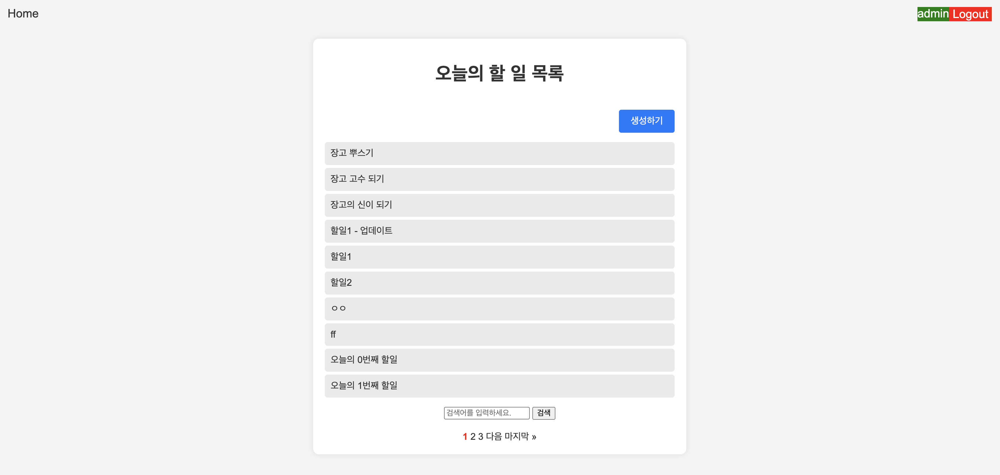

# ⭐️ 목표 : 검색, 페이지네이션, 글 생성/삭제/수정

# 📌 페이지 설명1 : 할일 목록 페이지 업데이트
 - Home, Logout, 할일 생성하기 버튼 추가
 - 사용자 정보 표시
 - 검색 기능 추가
 - 페이지네이션 추가

# 📌 페이지 설명2 : 할일 생성하기 페이지

# 📌 페이지 설명3 : 검색 기능 추가

# 📌 페이지 설명4 : 할일 상세 페이지 업데이트
  - 할일 수정하기, 삭제하기 버튼 추가

  
  - 작성자가 아닌 경우 수정, 삭제 불가

# 📌 페이지 설명5 : 할일 수정하기 페이지

